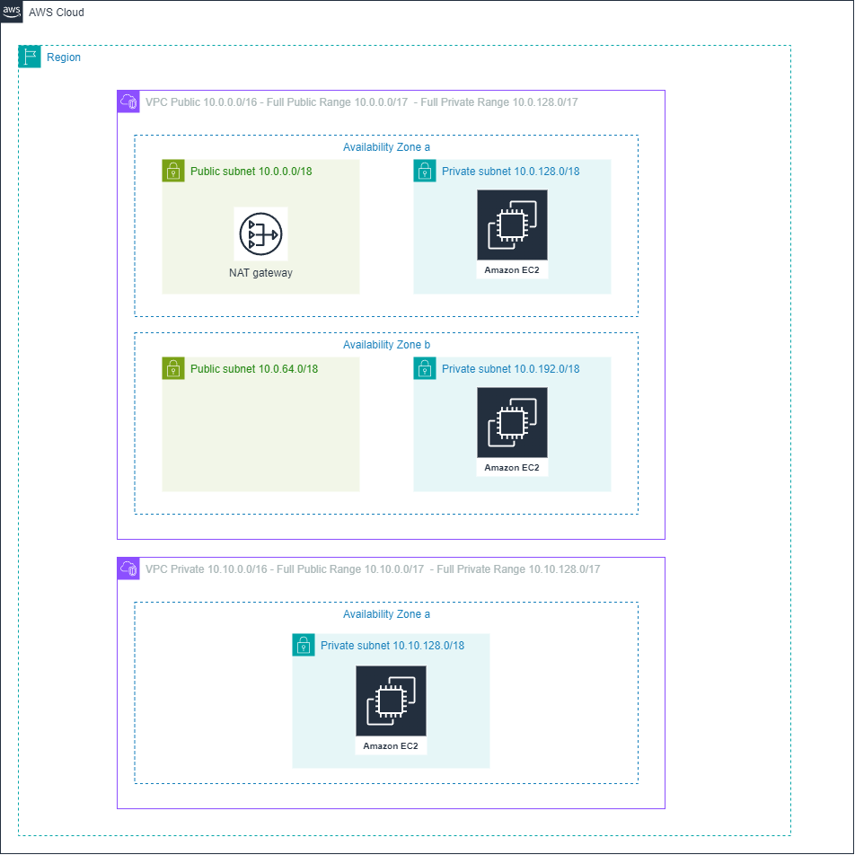

# cloud-computing-vpc-exercise

## Exercise

Mount a VPC with an Internet Gateway with two public subnets and a NAT Gateway. This VPC should connect via peering to a second VPC.

The second VPC should be able to ping one of the private subnets of the first VPC.

## Architecture



The VPC and subnet CIDR blocks are automatically generated, see **cidr_block_spec** and **cidr_block_increment** variables usage in the [locals](./src/locals.tf) file.

Each VPC CIDR block is divided in two ranges, the first one for public subnets and the second half for private subnets.

## Usage

```bash
terraform init
terraform plan -var public_key_path=key.pub -var inbound_cidr_block="0.0.0.0/0"
terraform apply -var public_key_path=key.pub -var inbound_cidr_block="0.0.0.0/0"
```

## SSH

```bash
ssh-keygen -t rsa -b 2048 -f <key>
scp -i <key> <file> ubuntu@<ip>:~/
```

## Checks

```bash
tcpdump -ni any icmp
```
